# powerPlus — PowerPoint 자산 라이브러리 Add-in

PowerPoint 작업창에서 회사 자산(아이콘·사진·일러스트·다이어그램·장표)을 **카테고리/태그로 검색 → 클릭 한 번에 슬라이드 삽입**하는 사내 도구.

- 사용자 규모: 사내 ~300명 (회사 도메인 `solideos.com`)
- 라이브 API: `https://hom2box.com/powerPlus/api`
- 관리자: `https://hom2box.com/powerPlus/admin/`

> 📸 아래 메뉴얼의 화면 캡처는 실제 운영 화면입니다(캡처 시점 자산 2,892개 — 자산은 계속 늘어나 현재 3,000개 이상이며, 화면의 숫자는 캡처 당시 기준입니다). 개인정보(사용자 이메일)는 모자이크 처리했습니다.

---

# 📖 사용 메뉴얼

| 구분 | 바로가기 |
|---|---|
| 설치 | [1. 설치 마법사](#1-설치--powerplus_setupexe) |
| 애드인(사용자) | [2-1 로그인](#2-1-로그인--이메일-인증) · [2-2 화면 구성](#2-2-기본-화면-구성) · [2-3 자산 탐색](#2-3-자산-탐색전체-탭) · [2-4 카테고리별 화면](#2-4-카테고리별-화면) · [2-5 검색](#2-5-검색) · [2-6 즐겨찾기·최근](#2-6-즐겨찾기--최근) · [2-7 웹 이미지](#2-7-웹-이미지-검색) · [2-8 콘텐츠 요청](#2-8-콘텐츠-요청) |
| 관리자 | [3-1 대시보드](#3-1-대시보드) · [3-2 자산 관리](#3-2-자산-관리) · [3-3 공지 관리](#3-3-공지-관리) · [3-4 요청 관리](#3-4-요청-관리) |
| 기타 | [4. FAQ / 문제 해결](#4-faq--문제-해결) |

---

## 1. 설치 — powerPlus_Setup.exe

`배포/사용자/powerPlus_Setup.exe`를 더블클릭하면 설치 마법사가 실행됩니다. **관리자 권한이 필요 없고**, 5단계로 1분 안에 끝납니다.

### 1-1. 시작

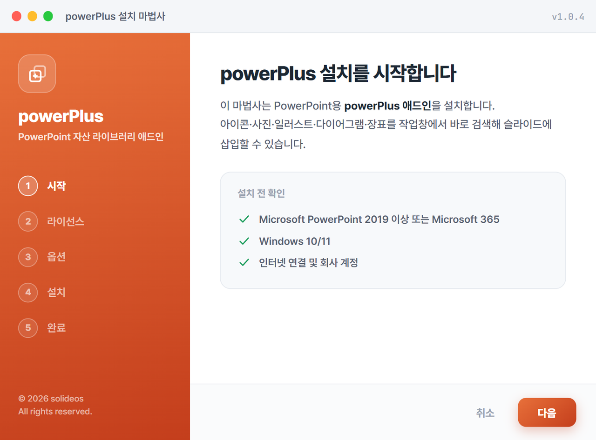

설치 전 요구사항을 안내합니다. 좌측 사이드바에 전체 5단계(시작→라이선스→옵션→설치→완료) 진행 상태가 표시됩니다.

| 요구사항 | 내용 |
|---|---|
| Office | Microsoft PowerPoint **2019 이상** 또는 Microsoft 365 (⚠️ 2016 이하는 미지원 — 설치기가 자동 감지해 안내) |
| OS | Windows 10 / 11 |
| 기타 | 인터넷 연결 + 회사 이메일 계정(`@solideos.com`) |

### 1-2. 라이선스 동의

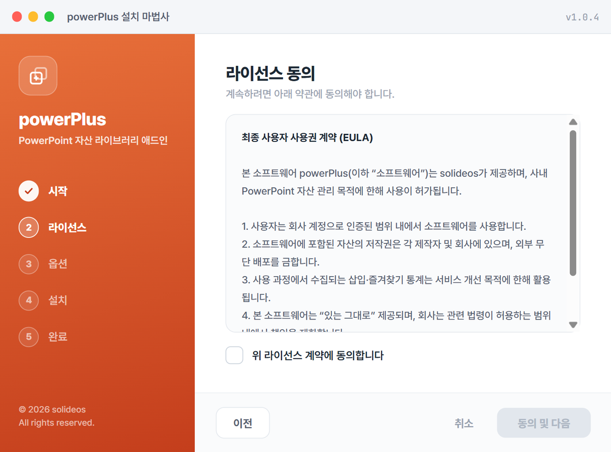

최종 사용자 사용권 계약(EULA)입니다. 핵심: 사내 사용 한정, 자산의 외부 무단 배포 금지, 삽입·즐겨찾기 통계는 서비스 개선 목적으로만 수집. **"위 라이선스 계약에 동의합니다"를 체크**해야 [동의 및 다음] 버튼이 활성화됩니다.

### 1-3. 설치 옵션

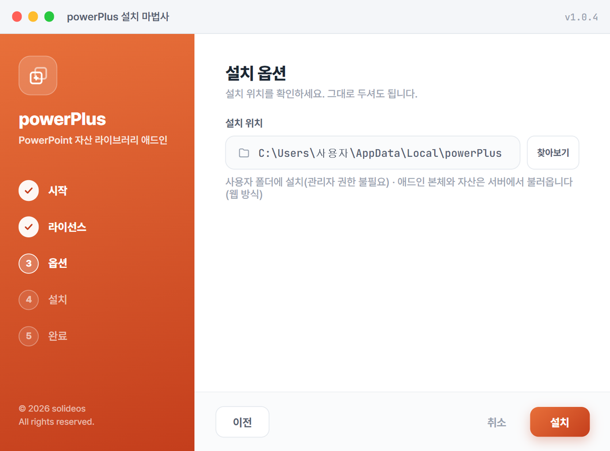

설치 위치를 확인합니다. 기본값(`C:\Users\<사용자>\AppData\Local\powerPlus`) 그대로 두면 됩니다.

- **사용자 폴더에 설치**되므로 관리자 권한이 필요 없습니다.
- 애드인 본체와 자산은 **서버에서 불러오는 웹 방식**이라 로컬에는 등록 정보(매니페스트)만 설치됩니다. → 이후 기능 업데이트 시 **재설치가 필요 없습니다.**

### 1-4. 설치 진행

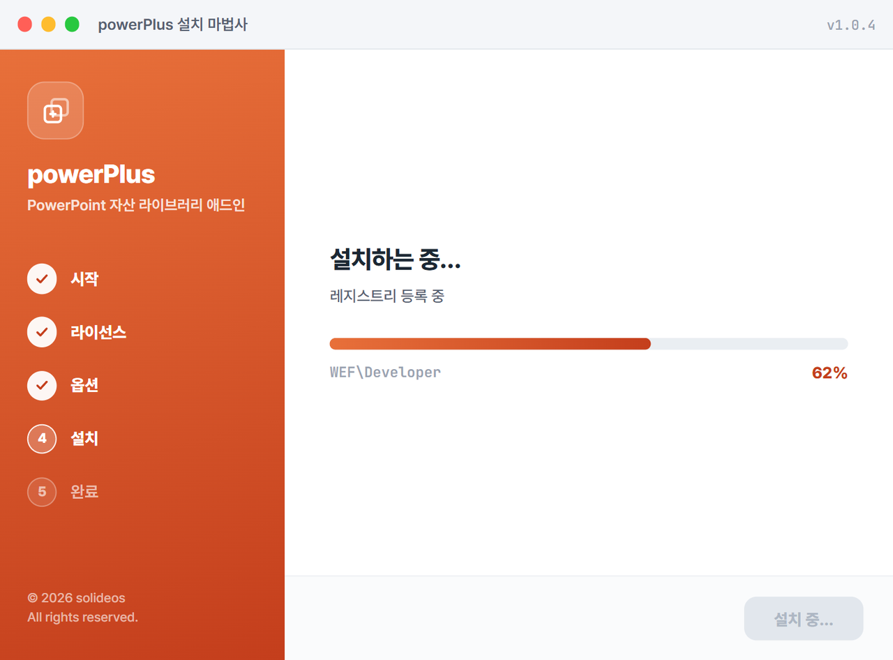

파일 복사와 PowerPoint 애드인 레지스트리 등록(`WEF\Developer`)이 자동으로 진행됩니다. 수 초 내에 완료됩니다.

### 1-5. 완료 → 실행 위치

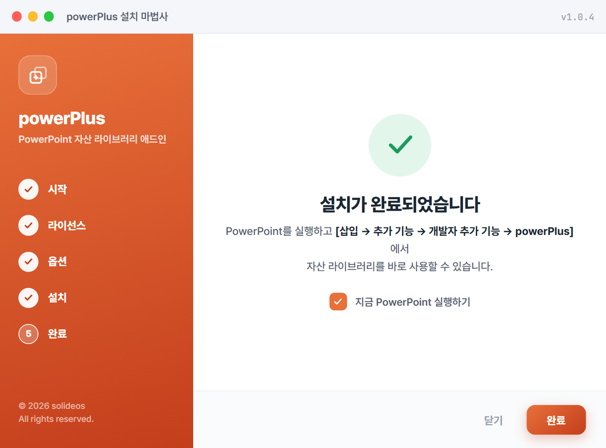

"지금 PowerPoint 실행하기"를 체크한 채 [완료]를 누르면 PowerPoint가 바로 열립니다.

> ⭐ **애드인 여는 방법**: PowerPoint 상단 메뉴에서
> **[삽입] → [추가 기능] → [개발자 추가 기능] → powerPlus**
> 를 클릭하면 우측에 작업창이 열립니다. (한 번 열어두면 이후 자동으로 같이 뜹니다)

---

## 2. 애드인 (PowerPoint 작업창)

### 2-1. 로그인 — 이메일 인증

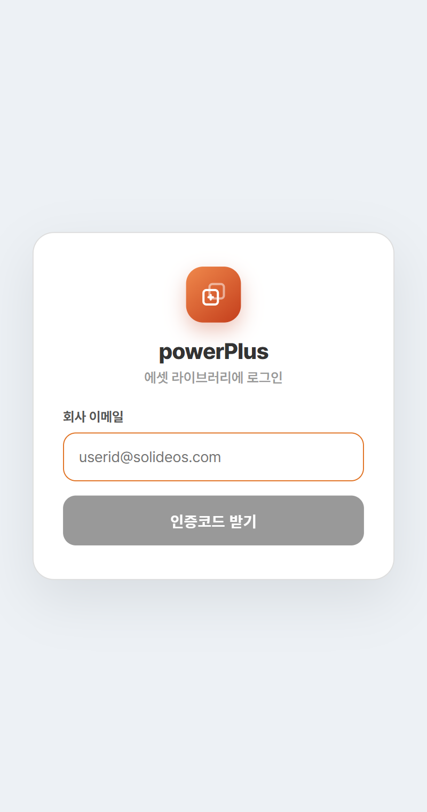

처음 실행하면 로그인 화면이 나옵니다. 별도 비밀번호가 없는 **이메일 인증코드(OTP) 방식**입니다.

1. **회사 이메일**(`아이디@solideos.com`)을 입력하고 [인증코드 받기]를 누릅니다.
2. 메일로 도착한 **6자리 인증코드**를 입력하면 로그인 완료.
3. 로그인 상태는 유지되므로 매번 인증할 필요는 없습니다(토큰 만료 시에만 재인증).

> - `solideos.com` 도메인 외 이메일은 사용할 수 없습니다.
> - 인증 메일이 안 보이면 **스팸함/프로모션함**을 확인하세요.
> - 인증코드는 10분간 유효하며, 재발송은 1분 간격으로 가능합니다.

### 2-2. 기본 화면 구성

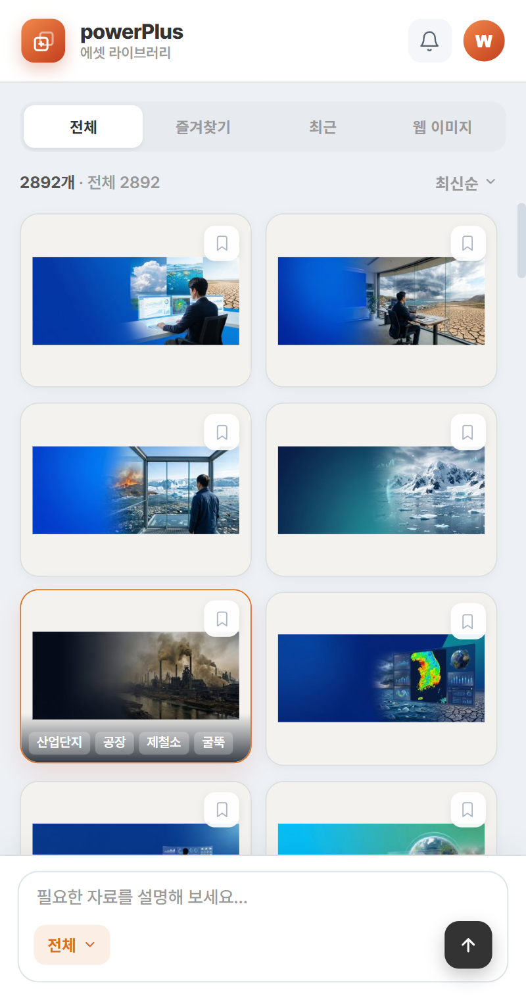

| 영역 | 위치 | 설명 |
|---|---|---|
| **헤더** | 상단 | 로고 · 🔔 알림(관리자 공지 — 새 공지가 있으면 배지 표시, 펼치면 읽음 처리) · 프로필 아이콘 |
| **상단 탭** | 헤더 아래 | **전체 / 즐겨찾기 / 최근 / 웹 이미지** 4개 탭 |
| **결과 바** | 탭 아래 | 현재 조건의 자산 수(예: `2892개 · 전체 2892`) + **정렬 드롭다운**(최신순 / 인기순 / 즐겨찾기순) |
| **자산 그리드** | 중앙 | 자산 카드 목록. 스크롤하면 계속 로드. 카테고리에 따라 2열(사진·장표 등) 또는 3열(아이콘·일러스트) |
| **검색 컴포저** | 하단 고정 | "필요한 자료를 설명해 보세요…" 입력창 + **카테고리 선택**(전체/아이콘/사진/일러스트/다이어그램/장표/로고) + ↑ 검색 버튼 |

### 2-3. 자산 탐색(전체 탭)

- **삽입**: 카드를 **클릭하면 현재 슬라이드에 바로 삽입**됩니다.
  - 이미지 자산(아이콘·사진·일러스트·다이어그램·로고) → 현재 선택 위치에 이미지로 삽입
  - 장표 자산 → 슬라이드 자체가 삽입(아래 2-4 참고)
- **카드에 마우스를 올리면** 해당 자산의 **등록 태그 4개**가 하단에 칩으로 표시됩니다(위 캡처의 `산업단지 공장 제철소 굴뚝` 참고) — 이미지만으로 구분이 어려울 때 활용하세요.
- **우상단 북마크(🔖) 버튼**으로 즐겨찾기에 추가/해제합니다(서버 저장 — PC를 바꿔도 유지).
- 목록은 **축소 썸네일**로 가볍게 표시되고, 삽입 시에는 **원본 화질**이 들어갑니다.

### 2-4. 카테고리별 화면

하단 검색 컴포저의 카테고리 버튼으로 전환합니다. 카테고리만 고르고 검색어 없이 ↑를 누르면 해당 카테고리 전체 탐색이 됩니다.

#### 장표 (382~682개 · PPT 슬라이드 자산)

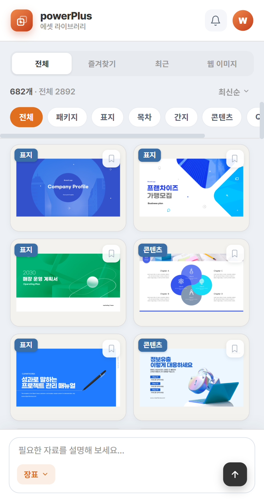

- 장표는 **그룹 칩**으로 한 번 더 필터링됩니다: **전체 / 패키지 / 표지 / 목차 / 간지 / 콘텐츠 / Q&A / 기타**
- 카드 좌상단에 그룹 뱃지(`표지`, `콘텐츠` 등)가 표시됩니다.
- 클릭 시 삽입 방식:
  - **패키지** = 제안서 전체 묶음 → **모든 슬라이드가 현재 슬라이드 뒤에 삽입**
  - **단일**(표지·목차·간지·콘텐츠 등) = **1장만 삽입**
- 삽입된 슬라이드는 원본 서식(폰트·색·레이아웃)을 그대로 유지하므로 바로 내용만 고쳐 쓰면 됩니다.

#### 아이콘 (921개+)

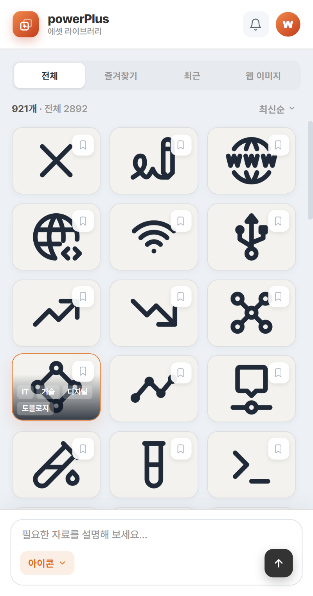

3열 그리드로 표시됩니다. 업무·IT·바이오·전자정부·보안 등 제안서용 라인 아이콘과 기후·환경·에너지 테마 3D 아이콘을 제공합니다. 투명 배경(PNG)이라 어떤 슬라이드 배경에도 얹을 수 있습니다.

#### 사진 (326개+)


와이드 고해상 배경 사진 — IT·데이터센터·반도체·바이오·기후위기·신재생에너지·비즈니스 테마. 표지/간지 배경으로 쓰기 좋게 구성돼 있습니다.

#### 일러스트 (361개+)

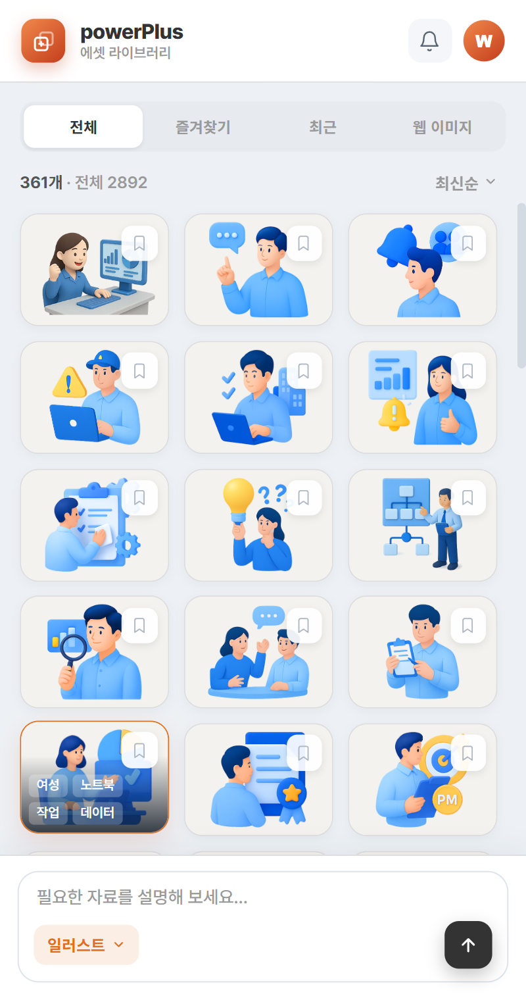

비즈니스 캐릭터 일러스트(발표·회의·데이터분석·협업·콜센터·의료 등). 3열 그리드.

### 2-5. 검색

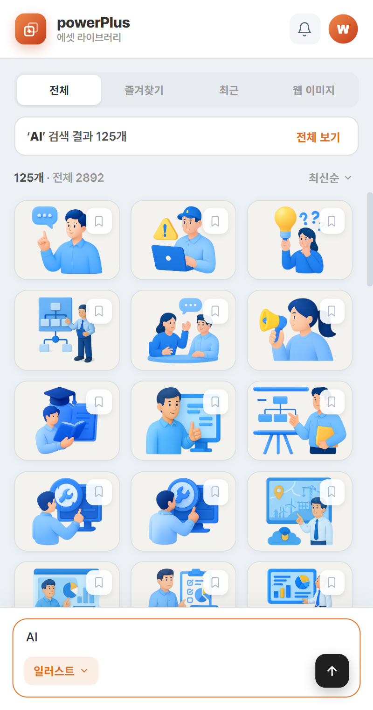

하단 컴포저에 키워드를 입력하고 ↑(또는 Enter)를 누르면 검색됩니다.

- **국문/영문 태그 + 자산명**을 함께 검색합니다. 동의어·한↔영 사전이 적용돼 "차트"로 검색해도 chart 태그가 잡힙니다.
- **색상 검색 지원**: "파란 아이콘"처럼 색을 섞어 검색할 수 있습니다(자산마다 색상 태그 자동 부여).
- **카테고리를 지정하고 검색**하면 그 카테고리 안에서만 찾습니다(캡처: 일러스트에서 'AI' 검색 → 125개).
- 검색 후 상단에 **`'키워드' 검색 결과 N개` 바**가 표시되고, [전체 보기]를 누르면 검색이 해제됩니다.
- **결과가 없으면** "‘키워드’ 자료 요청하기" 버튼이 나타나 [콘텐츠 요청](#2-8-콘텐츠-요청)으로 바로 이어집니다 — 요청하면 관리자가 해당 자료를 검토 후 추가합니다.

### 2-6. 즐겨찾기 · 최근

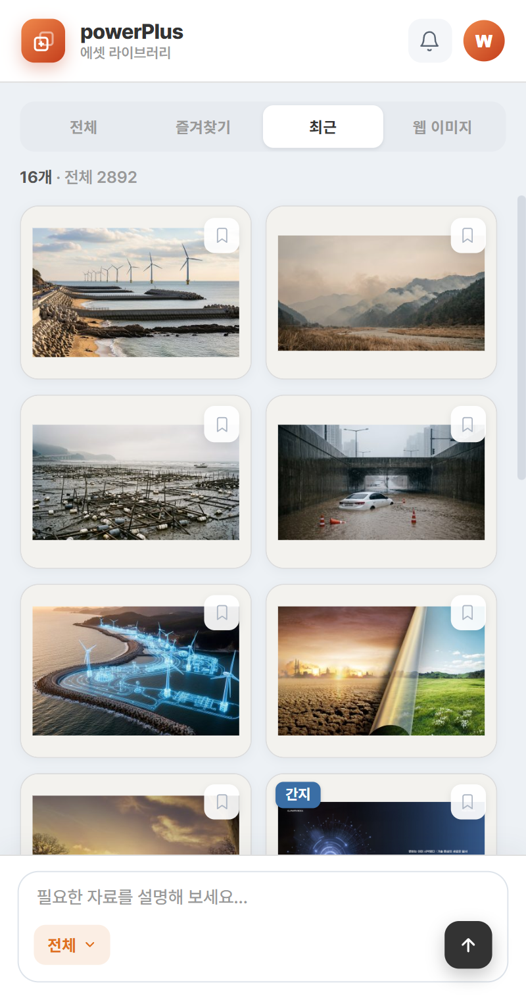

- **즐겨찾기 탭**: 북마크한 자산만 모아 봅니다. 자주 쓰는 표지·아이콘을 등록해 두면 매번 검색할 필요가 없습니다.
- **최근 탭**(캡처): **내가 최근에 삽입한 자산** 목록입니다. "지난번에 썼던 그 사진" 을 다시 찾을 때 가장 빠른 경로입니다.
- 두 목록 모두 **서버에 저장**되어 다른 PC에서 로그인해도 그대로 유지됩니다.

### 2-7. 웹 이미지 검색

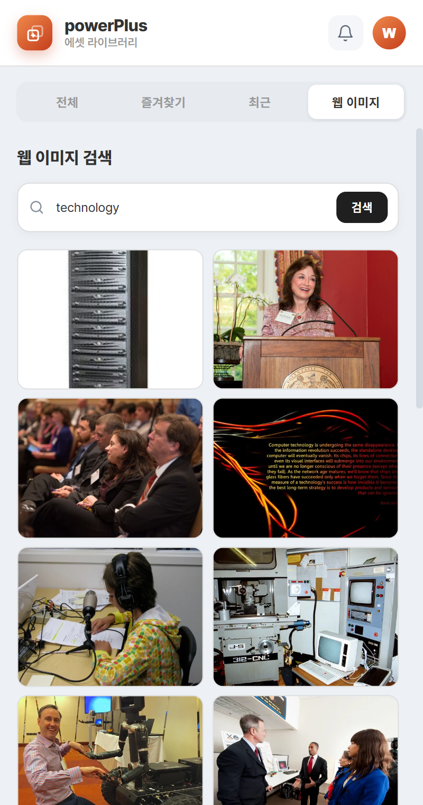

사내 라이브러리에 없는 이미지가 필요할 때, 작업창 안에서 **외부 무료 이미지를 검색해 바로 삽입**할 수 있습니다.

- 검색 소스는 **Openverse**(오픈 라이선스 이미지 — 상업적 사용 가능 CC 라이선스 위주)입니다.
- 검색어 입력 → [검색] → 결과 격자에서 **클릭하면 원본이 슬라이드에 삽입**됩니다.
- 스크롤 끝까지 내리면 다음 페이지가 자동으로 이어집니다(무한 스크롤).
- 검색어는 **영문 키워드**가 결과가 더 풍부합니다(예: technology, business, meeting).

### 2-8. 콘텐츠 요청

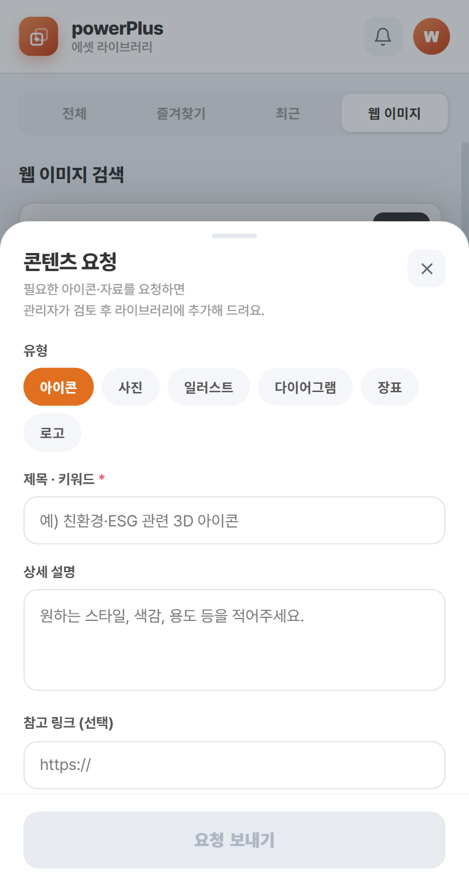

필요한 자료가 라이브러리에 없으면 **관리자에게 직접 요청**할 수 있습니다. (검색 무결과 화면의 "자료 요청하기" 버튼 또는 프로필 메뉴에서 열림)

| 입력 항목 | 설명 |
|---|---|
| **유형** | 아이콘 / 사진 / 일러스트 / 다이어그램 / 장표 / 로고 중 선택 (관리자 카테고리와 연동) |
| **제목·키워드*** | 필수. 예: "친환경·ESG 관련 3D 아이콘" |
| **상세 설명** | 원하는 스타일·색감·용도 등 자유 기술 |
| **참고 링크** | 선택. 참고할 이미지/사이트 URL |

[요청 보내기]를 누르면 관리자 [요청 관리](#3-4-요청-관리) 화면에 접수되고, 관리자가 검토 후 라이브러리에 추가합니다.

---

## 3. 관리자 대시보드

`https://hom2box.com/powerPlus/admin/` 접속 → 관리자 이메일로 **OTP 로그인**(애드인과 동일 방식). 관리자 권한 계정만 입장할 수 있습니다. 상단 탭 4개(**대시보드 / 자산 / 공지 / 요청**)로 구성됩니다.

### 3-1. 대시보드

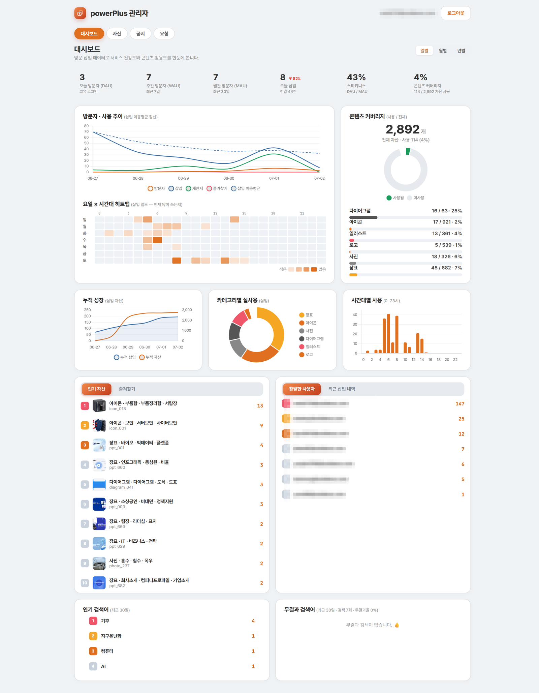

방문·삽입 데이터로 서비스 건강도와 콘텐츠 활용도를 한눈에 봅니다. 우상단 **일별/월별/년별** 토글로 기간 단위를 바꿀 수 있습니다.

**① 상단 KPI 6종**

| 지표 | 의미 |
|---|---|
| 오늘 방문자 (DAU) | 오늘 고유 로그인 사용자 수 |
| 주간 방문자 (WAU) | 최근 7일 고유 사용자 |
| 월간 방문자 (MAU) | 최근 30일 고유 사용자 |
| 오늘 삽입 | 오늘 자산 삽입 횟수 (전일 대비 증감 표시) |
| 스티키니스 | DAU ÷ MAU — 얼마나 꾸준히 쓰는지 |
| 콘텐츠 커버리지 | 전체 자산 중 실제 사용된 자산 비율 |

**② 차트 영역**

- **방문자·사용 추이**: 방문/삽입/제안서/즐겨찾기 시계열 + 삽입 이동평균 점선
- **요일 × 시간대 히트맵**: 언제 많이 쓰는지 밀도로 표시 (진할수록 많음)
- **콘텐츠 커버리지**: 전체 자산 수(대형 숫자) + 카테고리별 사용/전체 비율 막대
- **누적 성장**: 누적 삽입 × 누적 자산 수
- **카테고리별 실사용**: 실제 삽입 기준 도넛(등록 수가 아니라 "쓰이는" 카테고리를 봄)
- **시간대별 사용**: 0~23시 막대

**③ 순위·모니터링**

- **인기 자산 / 즐겨찾기 TOP10** (탭 전환): 썸네일·태그·자산 ID·횟수
- **활발한 사용자 / 최근 삽입 내역** (탭 전환): 사용자별 삽입 횟수 순위, 최근 삽입 피드
- **인기 검색어 / 무결과 검색어** (최근 30일): 사용자가 무엇을 찾는지, **무엇을 못 찾았는지**(무결과 검색어는 자산 보강의 최우선 후보)

### 3-2. 자산 관리

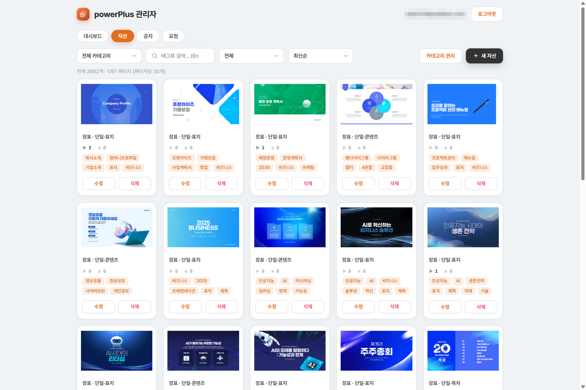

전체 자산의 조회·등록·수정·삭제를 담당합니다.

**툴바(위에서부터)**

| 컨트롤 | 기능 |
|---|---|
| 전체 카테고리 | 카테고리 필터 (아이콘/사진/일러스트/다이어그램/장표/로고) |
| 태그로 검색 | 국문/영문 태그·자산 ID 검색 |
| 장표 그룹 필터 | 장표 선택 시: 전체/패키지/표지/목차/간지/콘텐츠/Q&A/기타 |
| 정렬 | 최신순/이름/즐겨찾기/인기 |
| **[카테고리 관리]** | 카테고리 추가·이름 변경·삭제 모달 |
| **[+ 새 자산]** | 자산 등록 모달 |

**자산 카드**: 썸네일 · 분류(예: `장표 · 단일·표지`) · ▶ 삽입 횟수 · ★ 즐겨찾기 수 · 태그 칩(2줄까지 표시) · [수정] [삭제] 버튼. 목록은 **페이지당 30개** 페이징입니다.

**새 자산 등록**

- 아이콘/사진/일러스트/다이어그램/로고 = **이미지 파일(PNG/JPG)** 업로드 → 서버가 자동으로 리사이즈 + 썸네일 생성
- **장표** = **.ppt/.pptx 파일** 업로드(필수) + 썸네일 이미지(선택) + **유형 선택**: 패키지(전체 삽입) 또는 단일(표지·목차·간지·콘텐츠·Q&A·기타 중 페이지 종류 선택)
- 태그는 국문/영문으로 입력 — 검색 적중률을 위해 동의어·용도·색상까지 넉넉하게

> 대량 등록(수십~수백 개)은 관리 화면 대신 드롭 폴더 파이프라인을 사용합니다 → `server/bin/ASSET-IMPORT.md` 런북 참고.

### 3-3. 공지 관리

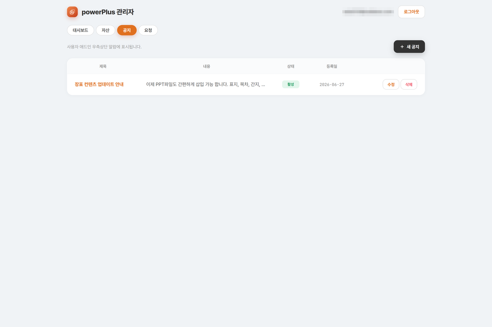

사용자 애드인의 **🔔 알림**에 표시되는 공지를 관리합니다.

- **[+ 새 공지]**: 제목·내용 입력 후 등록 → 즉시 전체 사용자 애드인에 알림 배지가 뜹니다.
- **상태(활성/비활성)**: 비활성으로 바꾸면 사용자에게 더 이상 노출되지 않습니다(삭제하지 않고 내릴 때 사용).
- 신규 자산 업데이트, 점검 안내 등 사용자에게 알릴 내용에 활용하세요.

### 3-4. 요청 관리

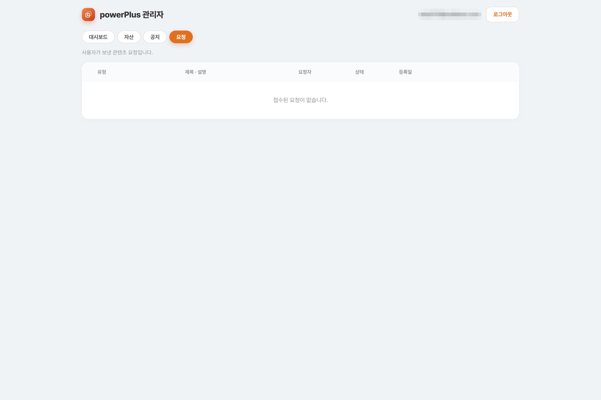

사용자가 애드인에서 보낸 [콘텐츠 요청](#2-8-콘텐츠-요청)이 접수되는 곳입니다.

- 목록 컬럼: **유형 / 제목·설명 / 요청자 / 상태 / 등록일**
- 상태 관리: **신규(new) → 완료(done) / 거절(rejected)** — 요청 자산을 라이브러리에 등록했으면 완료로, 부적합하면 거절로 처리합니다.
- 대시보드의 **무결과 검색어**와 함께 보면 "사용자가 원하는데 없는 자산"의 우선순위를 잡기 좋습니다.

---

## 4. FAQ / 문제 해결

| 증상 | 원인 / 해결 |
|---|---|
| 애드인 메뉴가 안 보임 | PowerPoint 재시작 → [삽입 → 추가 기능 → 개발자 추가 기능]에서 확인. 그래도 없으면 설치 exe 재실행 |
| 작업창이 하얗게(백지) 나옴 | **Office 2016 이하** — 구형 웹엔진(IE11)이라 미지원. 안내 페이지가 자동 표시되며, Office 2019/2021/365로 업그레이드 필요 |
| 인증 메일이 안 옴 | 스팸함/프로모션함 확인. 1분 후 재발송 가능 |
| 클릭해도 삽입이 안 됨 | 웹 브라우저에서 열었을 때는 삽입 불가(안내 토스트) — **PowerPoint 작업창 안에서만** 삽입됩니다 |
| 삽입 위치가 이상함 | 도형/개체를 먼저 선택해 두면 그 위치·크기에 맞춰 삽입됩니다 |
| 아이콘이 옛 디자인으로 보임 | Office가 아이콘을 캐시함 — 애드인 재설치(설치 exe 재실행) 시 갱신 |
| 관리자 페이지 로그인 불가 | 관리자 권한 계정인지 확인(일반 사용자 계정은 입장 불가) |

---
---

# 🛠 개발 문서

## 📁 폴더 구조

| 폴더 | 무엇 | 비고 |
|---|---|---|
| **`addin/`** | 애드인(작업창) 프론트엔드 — React 18 + TypeScript + Webpack 5, Office.js | 빌드 결과 `dist/`는 서버 `app/`으로 배포 |
| **`server/`** | 백엔드 API — PHP + MySQL(MariaDB), 프레임워크 없이 PDO | `index.php`(라우터)→Controller→Service→Database |
| **`server/admin/`** | 관리자 웹 대시보드(단일 HTML) — 자산/카테고리/공지/요청/통계 | 서버에서 호스팅 |
| **`server/bin/`** | 배포·마이그레이션·자산 임포트 스크립트 + 런북 | `deploy.sh`, `migrate.php`, `import-assets.php`, `ASSET-IMPORT.md` |
| **`installer/`** | **설치 마법사 소스** — WebView2(.NET8 WinForms) + 시안 HTML UI | 빌드하면 `powerPlus_Setup.exe` 생성 (개발용, 고객에 주지 않음) |
| **`design/`** | 디자인 시안(`*.dc.html`) — 디자인시스템/애드온/관리자/설치 | 구현의 1:1 기준(mock) |
| **`docs/manual/`** | 이 README 메뉴얼의 화면 캡처(개인정보 마스킹본) | 원본 캡처는 `_capture/`(git 제외) |
| **`배포/`** | **전달용 완성품**(대상별 분리) | [배포/README.md](배포/README.md) 참고 |
| **`data/`** | 자산 원본/스테이징(대량 등록용) | git 제외(.gitignore), 서버 uploads에 보관 |
| **`.claude/`** | 개발 컨텍스트 라이브러리(myDev 서브모듈, 비공개) | 프로젝트 repo엔 포인터 커밋 안 함 |

### 배포물(대상별) — `배포/`
- `배포/사용자/` : **일반 사용자**에게 → 설치 파일 `powerPlus_Setup.exe` + [설치·사용 안내](배포/사용자/설치_및_사용안내.md)
- `배포/관리자/` : **관리자**에게 → [관리자 대시보드 안내](배포/관리자/관리자_안내.md)

> ✅ **설치 exe(`배포/사용자/powerPlus_Setup.exe`)는 git에 포함**됩니다 → 다른 PC에서 `git pull`하면 바로 받아집니다. (백업: [GitHub Releases](https://github.com/homebox78/powerPlus/releases/latest))
> 새로 빌드했으면 `installer/powerPlus_Setup.exe` → `배포/사용자/`로 복사 후 **git에 커밋**(`git add 배포/사용자/powerPlus_Setup.exe`)해야 다른 PC가 최신을 받습니다.

## 🏗️ 기술 스택
- **애드인**: React 18 · TypeScript 5.6 · Webpack 5 · Office.js · plain CSS(디자인 토큰)
- **서버**: PHP · MariaDB(PDO, prepared statement) · REST/JSON
- **호스팅**: hom2box.com (GCP Compute Engine VM, Apache 서브디렉터리)
- **인증**: 이메일 OTP(6자리) + `solideos.com` 도메인 제한
- **폰트/디자인**: Pretendard + JetBrains Mono, 오렌지 팔레트(Primary `#E0701F`, 채움버튼=블랙)

## ▶️ 개발 / 빌드 / 배포

```bash
# 애드인 개발 서버 (작업창 https + /api 프록시)
cd addin && npm install && npm start

# 애드인 운영 빌드
cd addin && npm run build      # → addin/dist

# 서버+애드인 한 방 배포 (SSH/SCP, config.php는 서버 값 보존)
cd server && bash bin/deploy.sh

# 설치 exe 빌드 (수정 시: installer.html / manifest 바뀔 때)
cd installer && dotnet publish -c Release -r win-x64 --self-contained true \
  -p:PublishSingleFile=true -p:IncludeNativeLibrariesForSelfExtract=true \
  -p:EnableCompressionInSingleFile=true
# → installer/powerPlus_Setup.exe (배포/사용자/로 복사)
```

> 애드인/관리자 코드는 **서버 호스팅**이라, 코드 업데이트 시 사용자 재설치 불필요(배포만 하면 자동 반영). 설치 exe는 아이콘/매니페스트가 바뀔 때만 재빌드.

## 🔑 핵심 기술 포인트
- 이미지 삽입: `Office.context.document.setSelectedDataAsync(base64, {coercionType:Image, …})` — `slide.shapes.addImage`는 런타임에 없음
- 장표 삽입: `presentation.insertSlidesFromBase64(b64, {formatting, targetSlideId})` — 선택 슬라이드 뒤
- 크기 단위는 pt(px 아님), 삽입은 PowerPoint 런타임에서만
- 설치 위치: PowerPoint **[삽입 → 추가 기능 → 개발자 추가 기능 → powerPlus]**

## ⚙️ 설정 / 시크릿 (git 제외)
- `server/config/config.php` — DB·메일·인증 설정 (템플릿: `config.example.php`)
- `server/config/deploy.env`, SSH 키(`*.pem`) — 배포 접속 정보
- 전부 `.gitignore` + 서버 `.htaccess` deny

## 📌 남은 작업
- 실제 PowerPoint 삽입/리본 사용자 더블클릭 테스트
- 메일 발신 신뢰도(회사 SMTP 또는 SPF/DKIM)
- 인프라 보안(phpMyAdmin 공개 제한, 키/DB 비번 관리)
